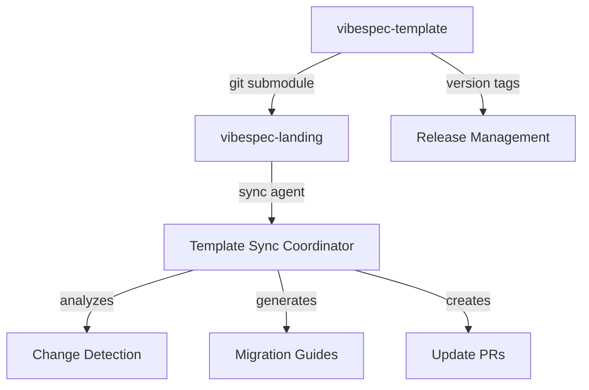

# Template Management Implementation Plan

## Executive Summary

This document outlines the complete implementation plan for separating the VibeSpec project into two repositories:
1. **vibespec-template**: A clean, reusable starter template
2. **vibespec-landing**: The marketing/landing page that uses the template

The plan includes a novel AI-powered synchronization system using Claude Code sub-agents to manage updates between repositories.

## Current State

As of 2025-07-30:
- Successfully removed 6,181 lines of landing-specific code from the template
- Created clean starter pages and enhanced dashboard
- All tests passing (build, lint, typecheck)
- Ready for repository separation on `template-cleanup` branch

## Architecture Overview



## Implementation Phases

### Phase 1: Repository Setup (Day 1)

#### 1.1 Create Template Repository
**Actions:**
1. Create new GitHub repository: `vibespec/vibespec-template`
2. Push cleaned template code from `template-cleanup` branch
3. Set up repository settings (description, topics, etc.)
4. Create initial release tag `v1.0.0`

**Commands:**
```bash
# After creating repo on GitHub
git remote add template https://github.com/vibespec/vibespec-template.git
git push template template-cleanup:main
git tag -a v1.0.0 -m "Initial template release"
git push template v1.0.0
```

#### 1.2 Prepare Landing Page Repository
**Actions:**
1. Current repository becomes the landing page
2. Document customizations in `.template-version`
3. Create sync documentation structure
4. Prepare for submodule integration

**File Structure:**
```
vibespec-landing/
├── .template-version     # Template version tracking
├── TEMPLATE_SYNC.md      # Synchronization guide
├── sync-scripts/         # Automation scripts
└── .sync/               # Sync metadata
    ├── applied/
    ├── skipped/
    ├── conflicts/
    └── history.json
```

### Phase 2: Dependency Implementation (Day 1-2)

#### 2.1 Git Submodule Integration
**Rationale:** Submodules provide direct code access while maintaining version control.

**Setup:**
```bash
# In landing page repository
git submodule add https://github.com/vibespec/vibespec-template.git template-core
git submodule update --init --recursive

# Configure submodule to track main branch
git config -f .gitmodules submodule.template-core.branch main
```

#### 2.2 Project Restructuring
**New Structure:**
```
vibespec-landing/
├── template-core/        # Git submodule (template code)
├── src/
│   ├── components/
│   │   ├── landing/     # Landing-specific components
│   │   └── overrides/   # Template component overrides
│   ├── app/
│   │   ├── (marketing)/ # Landing-specific pages
│   │   └── (app)/       # From template
│   └── lib/
│       ├── landing/     # Landing-specific utilities
│       └── overrides/   # Template overrides
```

#### 2.3 Import Path Configuration
**Update `tsconfig.json`:**
```json
{
  "compilerOptions": {
    "paths": {
      "@/*": ["./src/*"],
      "@template/*": ["./template-core/src/*"],
      "@landing/*": ["./src/components/landing/*"],
      "@overrides/*": ["./src/components/overrides/*"]
    }
  }
}
```

**Update `next.config.ts`:**
```typescript
const nextConfig = {
  // Include template-core in transpilation
  transpilePackages: ['template-core'],
  // ... other config
};
```

### Phase 3: AI-Powered Sync System (Day 2)

#### 3.1 Template Sync Coordinator Agent
**Purpose:** Intelligent analysis and migration assistance for template updates.

**Create `.claude/agents/template-sync-coordinator.md`:**
```yaml
name: template-sync-coordinator
description: Analyzes template changes and generates precise migration instructions
tools: Bash, Read, Write, Grep, Glob
```

**Key Capabilities:**
1. Analyze git diffs between template versions
2. Categorize changes (breaking, feature, fix)
3. Detect conflicts with customizations
4. Generate migration scripts
5. Create detailed update reports

#### 3.2 Sync Commands
**Create `.claude/commands/sync-commands.md`:**
- `/sync:check` - Check for template updates
- `/sync:analyze [version]` - Detailed change analysis
- `/sync:apply [component]` - Apply specific updates
- `/sync:skip [component]` - Mark as intentionally skipped
- `/sync:conflicts` - Show merge conflicts
- `/sync:report` - Generate sync status report
- `/sync:pr` - Create PR with changes

#### 3.3 Metadata Tracking System
**Structure:**
```json
// .sync/history.json
{
  "syncHistory": [
    {
      "date": "2025-07-30",
      "fromVersion": "1.0.0",
      "toVersion": "1.1.0",
      "applied": ["components/ui/button", "hooks/use-toast"],
      "skipped": ["components/admin"],
      "conflicts": ["services/auth"],
      "migrationNotes": "Breaking change in Button API"
    }
  ]
}
```

### Phase 4: Workflow Automation (Day 3)

#### 4.1 Template Release Process
**In template repository:**
1. Develop on feature branches
2. Create PR with change classification
3. Merge to main
4. Tag release with semantic version
5. Generate changelog
6. Trigger sync notifications

**Automated with GitHub Actions:**
```yaml
name: Release Template
on:
  push:
    tags:
      - 'v*'
jobs:
  release:
    steps:
      - Generate changelog
      - Create GitHub release
      - Notify dependent projects
```

#### 4.2 Landing Page Update Workflow
**Step-by-step process:**
```bash
# 1. Developer checks for updates
claude-code
> /sync:check

# Output:
# New template version available: v1.1.0
# Changes: 3 bug fixes, 2 new features, 1 breaking change

# 2. Analyze specific changes
> /sync:analyze v1.1.0

# Output:
# Breaking Changes:
# - Button: 'color' prop renamed to 'variant'
#   Affects: 23 files in landing page
#   Migration: Available (auto-applicable)
#
# New Features:
# - Added Loading component
# - Added useDebounce hook
#
# Bug Fixes:
# - Fixed modal accessibility
# - Fixed theme toggle race condition
# - Fixed form validation edge case

# 3. Apply updates selectively
> /sync:apply components/ui --except button
> /sync:apply hooks/use-debounce
> /sync:skip components/loading  # Not needed yet

# 4. Handle breaking changes
> /sync:migrate button-color-to-variant

# 5. Generate PR
> /sync:pr "Update template to v1.1.0"
```

#### 4.3 Automation Scripts
**Create in `sync-scripts/`:**

**check-updates.sh:**
```bash
#!/bin/bash
# Check for new template versions
cd template-core
git fetch origin
CURRENT=$(git describe --tags)
LATEST=$(git describe --tags origin/main)
if [ "$CURRENT" != "$LATEST" ]; then
  echo "Update available: $CURRENT → $LATEST"
fi
```

**apply-safe-updates.sh:**
```bash
#!/bin/bash
# Automatically apply non-breaking updates
claude-code --command "/sync:apply --non-breaking"
```

### Phase 5: Documentation System (Day 3-4)

#### 5.1 Template Documentation
- **README.md** - Getting started, features, usage
- **CHANGELOG.md** - Detailed version history
- **MIGRATION.md** - Version-specific migration guides
- **API.md** - Component and service documentation
- **CONTRIBUTING.md** - How to contribute

#### 5.2 Landing Page Documentation
- **TEMPLATE_SYNC.md** - How synchronization works
- **CUSTOMIZATIONS.md** - What's been modified from template
- **OVERRIDE_GUIDE.md** - How to properly override template code

#### 5.3 Sync Documentation
**TEMPLATE_SYNC.md structure:**
```markdown
# Template Synchronization Guide

## Overview
This project uses vibespec-template as its foundation...

## Current Status
- Template Version: 1.0.0
- Last Sync: 2025-07-30
- Customized Components: [list]

## Update Process
1. Check for updates: `/sync:check`
2. Review changes: `/sync:analyze`
3. Apply updates: `/sync:apply`

## Customizations
The following have been customized and should not be auto-updated:
- /components/landing/* - All marketing components
- /app/roadmap/* - Roadmap feature
...
```

### Phase 6: Quality Assurance (Day 4)

#### 6.1 Testing Strategy
**Template Tests:**
```typescript
// template-core/tests/components.test.ts
- Component rendering tests
- API compatibility tests
- Build verification
```

**Landing Integration Tests:**
```typescript
// tests/template-integration.test.ts
- Verify template imports work
- Check override precedence
- Validate customizations intact
```

#### 6.2 CI/CD Pipeline
**.github/workflows/template-sync-check.yml:**
```yaml
name: Template Sync Check
on:
  schedule:
    - cron: '0 9 * * 1'  # Weekly on Mondays
  workflow_dispatch:

jobs:
  check-updates:
    runs-on: ubuntu-latest
    steps:
      - uses: actions/checkout@v3
        with:
          submodules: recursive
      
      - name: Check for template updates
        run: ./sync-scripts/check-updates.sh
      
      - name: Run compatibility tests
        run: npm run test:template-integration
      
      - name: Create issue if updates needed
        if: failure()
        uses: actions/create-issue@v2
        with:
          title: "Template updates available"
          body: "New template version detected. Run `/sync:check` for details."
```

#### 6.3 Monitoring & Metrics
Track:
- Sync success rate
- Time to apply updates
- Number of conflicts
- Custom override count
- Breaking change frequency

### Phase 7: Initial Implementation (Day 5)

#### 7.1 Baseline Documentation
1. Document all current customizations
2. Create override map
3. List modified files
4. Note architectural decisions

#### 7.2 First Sync Test
1. Make minor change in template (e.g., fix typo)
2. Tag as v1.0.1
3. Use sync agent to detect and apply
4. Verify success
5. Document process

#### 7.3 Team Onboarding
- Create video walkthrough
- Write step-by-step guide
- Set up Q&A session
- Create troubleshooting guide

## Success Criteria

### Technical Success
- [ ] Zero broken builds from synchronization
- [ ] Updates can be applied in < 10 minutes
- [ ] All customizations preserved during updates
- [ ] Clear conflict resolution process
- [ ] Automated testing catches issues

### Process Success
- [ ] Weekly sync checks happening
- [ ] Clear documentation maintained
- [ ] Team comfortable with process
- [ ] Community can use template easily
- [ ] Both repos evolving effectively

## Risk Management

### Risk 1: Merge Conflicts
**Mitigation:**
- Sync agent provides detailed conflict analysis
- Clear override patterns established
- Manual merge guide available

### Risk 2: Breaking Changes
**Mitigation:**
- Semantic versioning strictly followed
- Migration guides auto-generated
- Can pin to specific versions
- Rollback procedure documented

### Risk 3: Divergence Over Time
**Mitigation:**
- Regular architecture reviews
- Shared component guidelines
- Clear boundaries documented
- Refactoring plan for convergence

### Risk 4: Complexity Overhead
**Mitigation:**
- Automation reduces manual work
- Clear documentation
- Gradual rollout
- Escape hatches available

## Timeline

### Week 1 (Days 1-5)
- **Monday**: Repository setup
- **Tuesday**: Submodule integration
- **Wednesday**: Sync agent creation
- **Thursday**: Documentation & testing
- **Friday**: First implementation

### Week 2
- Refinement based on initial usage
- Team training
- Process optimization
- Community documentation

### Ongoing
- Weekly sync checks
- Monthly architecture review
- Quarterly retrospective
- Continuous improvement

## Conclusion

This implementation plan provides:
1. **Clear separation** between template and landing page
2. **Intelligent synchronization** via AI agents
3. **Flexible update control** with selective application
4. **Comprehensive documentation** for all scenarios
5. **Automated assistance** reducing manual overhead

The system balances automation with control, allowing both repositories to evolve while maintaining their connection. The AI-powered sync agent adds intelligence to the process, making updates safer and more efficient than traditional approaches.

## Next Steps

1. Review and approve this plan
2. Create the template repository
3. Implement Phase 1 (repository setup)
4. Test with template-cleanup branch
5. Proceed with subsequent phases
6. Document lessons learned

Ready to begin implementation!